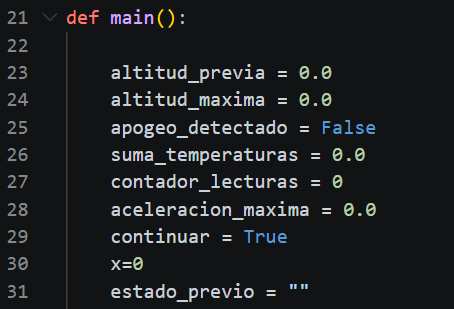
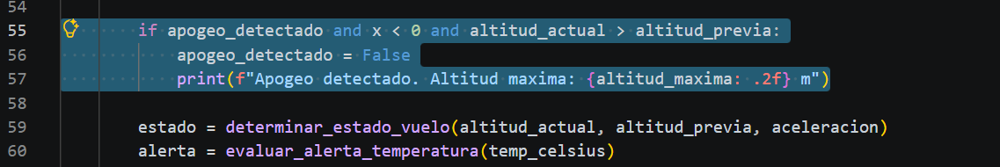
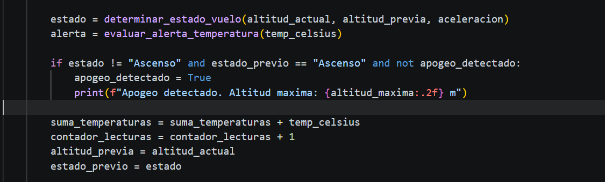
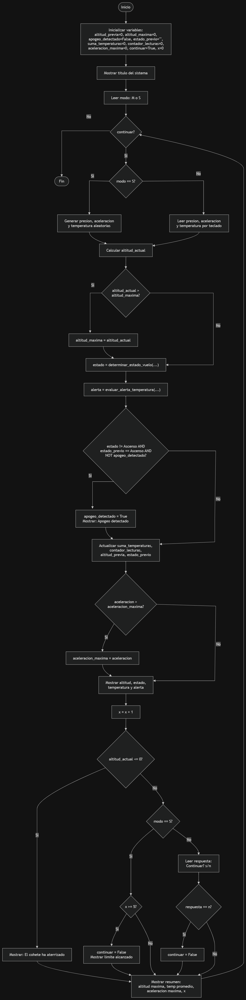

# RETO UNIDAD 3

  ANTES DE REVISAR EL TRABAJO. EN EL MOMENTO DE REALIZAR EL PSEUDOCODIGO Y EL DIAGRAMA DE FLUJO ME PERCATE DE ERRORES EN UNA PARTE DE EL CODIGO HABIA PUESTO UN CONDICIONAL QUE NUNCA SE PODIA CUMPLIR POR LO QUE NUNCA SE IMPRIMIA ES POR ESO QUE CONTACTE A MI AMIGO PARA VER UNA SOLUCION A ESTE PROBLEMA Y ME DIJO DE AÑADIR UNA VARIABLE DE ESTADO-PREVIO CON ESTA NUEVA VARIABLE SI PUEDO HACER UN CONDICIONAL QUE SE PUESDA CUMPLIR HE IMPRIMIR A CONTINUACION MOSTRARE LA IMAGEN DE QUE PARTE DEL CODIGO SE MODIFICO
  
  
  
  EN ESTE PUNTO COMO DIJE ANTERIORMENTE AÑADI LA VARIABLE, EN LA EXPLICACION DE PORQUE PUSE "" MI AMIGO ME COMENTO QUE ERA POR EL HECHO DE QUE AL INICIO DE LA SIMULACION NO HAY ESTADO PREVIO DE ESTADO POR LO QUE NECESITA INICIAR VACIO
  
   
  
  EN ESTE OTRO JUSTE LO QUE HICE FUE ELIMINAR MI CONDICIONAL ANTERIOR QUE REPITO NO SE PODIA CUMPLIR POR LO QUE NUNCA SE IMPRIMIA, POSTERIORMENTE HICE UN NUEVO CONDICIONAL EN EL QUE SI SE PUDIESE IMPRIMIR EL APOGEO, OTRO CAMBIO ADICIONAL FUE EL CAMBIO DE POSICION DE EL ESTADO = LA FUNCION determinar_estado_vuelo Y ALERTA = LA FUNCION evaluar_alerta_temperatura, YA POR ULTIMO Y NO MENOS IMPORTANTE LUEGO DEL CONDICIONAL PUSE QUE estado_previo = estado PARA QUE SE ACTUALICE LUEGO DEL CICLO 

  ## Usuario GitHub De mi amigo  y guia en el proyecto

  Marcelo17-m
  
  ## Pseudocodigo 
  
      FUNCIÓN calcular_altitud(presion_hpa)
        altitud = 44330 * (1 - (presion_hpa / 1013.25) ^ 0.1903)
        RETORNAR altitud
      FIN FUNCIÓN

      FUNCIÓN determinar_estado_vuelo(altitud_actual, altitud_previa, aceleracion)
          SI altitud_actual > altitud_previa ENTONCES
            estado = "Ascenso"
          SINO SI |aceleracion| > 8 ENTONCES
            estado = "Apogeo Inicio de Caida Libre"
          SINO
            estado = "Despliegue de Paracaidas"
          FIN SI
          RETORNAR estado
      FIN FUNCIÓN

      FUNCIÓN evaluar_alerta_temperatura(temp_celsius)
          limite_critico ← 90.0
          alerta = (temp_celsius > limite_critico)
          RETORNAR alerta
      FIN FUNCIÓN
      
      INICIO PROGRAMA PRINCIPAL
      altitud_previa = 0.0
      altitud_maxima = 0.0
      apogeo_detectado = FALSO
      suma_temperaturas = 0.0
      contador_lecturas = 0
      aceleracion_maxima = 0.0
      continuar = VERDADERO
      x = 0
      estado_previo = ""

      MOSTRAR "Sistema de Monitoreo de Vuelo - Cohete suborbital"
      LEER modo ("M" manual o "S" simulación)

        MIENTRAS continuar HACER

          SI modo = "S" ENTONCES
            presion_hpa = número aleatorio entre 200.0 y 1013.25
            aceleracion = número aleatorio entre -9.81 y 50.0
            temp_celsius = número aleatorio entre 25.0 y 150.0
          SINO
            LEER presion_hpa
            LEER aceleracion
            LEER temp_celsius
          FIN SI

          altitud_actual = calcular_altitud(presion_hpa)

          SI altitud_actual > altitud_maxima ENTONCES
            altitud_maxima = altitud_actual
          FIN SI
        
          estado = determinar_estado_vuelo(altitud_actual, altitud_previa, aceleracion)
          alerta = evaluar_alerta_temperatura(temp_celsius)

          SI estado ≠ "Ascenso" Y estado_previo = "Ascenso" Y NO apogeo_detectado ENTONCES
            apogeo_detectado = VERDADERO
            MOSTRAR "Apogeo detectado. Altitud máxima: " + altitud_maxima
          FIN SI

          suma_temperaturas = suma_temperaturas + temp_celsius
          contador_lecturas = contador_lecturas + 1
          altitud_previa = altitud_actual
          estado_previo = estado
        
          SI aceleracion > aceleracion_maxima ENTONCES
            aceleracion_maxima = aceleracion
          FIN SI

          MOSTRAR "Altitud: " + altitud_actual
          MOSTRAR "Estado: " + estado
          MOSTRAR "Temperatura: " + temp_celsius

          SI alerta ENTONCES
            MOSTRAR "ALERTA TERMICA: SI"
          SINO
            MOSTRAR "ALERTA TERMICA: NO"
          FIN SI

          x = x + 1

          SI altitud_actual <= 0 ENTONCES
            MOSTRAR "El cohete ha aterrizado. Fin de la simulación."
          SINO SI modo = "S" ENTONCES
            SI x >= 5 ENTONCES
                continuar = FALSO
                MOSTRAR "Se ha alcanzado el límite de lecturas en modo simulación."
            FIN SI
          SINO SI modo = "M" ENTONCES
            LEER respuesta "¿Continuar? (s/n)"
            SI respuesta = "n" ENTONCES
                continuar = FALSO
            FIN SI
          FIN SI

          temperatura_promedio = SI contador_lecturas > 0 ENTONCES suma_temperaturas / contador_lecturas SINO 0.0

          MOSTRAR "Altitud máxima (apogeo): " + altitud_maxima
          MOSTRAR "Temperatura promedio: " + temperatura_promedio
          MOSTRAR "Aceleración máxima registrada: " + aceleracion_maxima
          MOSTRAR x

      FIN MIENTRAS
      
    FIN PROGRAMA

  ## Diagrama de flujo
  
  (ME CANSE DE TRATAR QUE TODO QUEDARA EN LINEA RECTA ASI QUE LO DEJE ASI)
